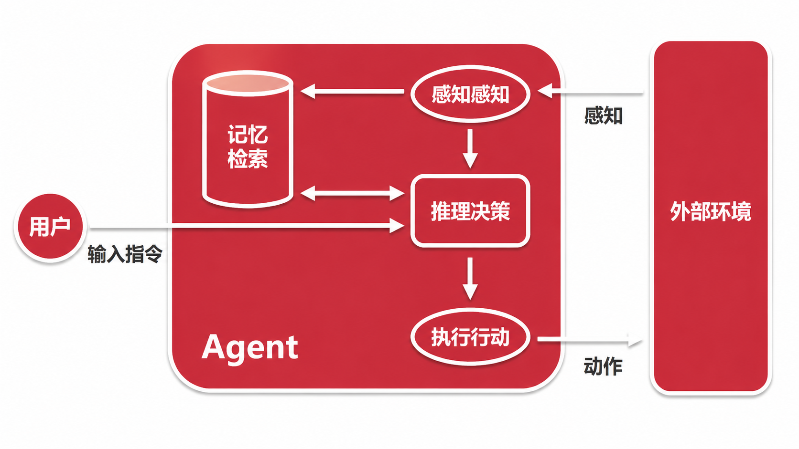
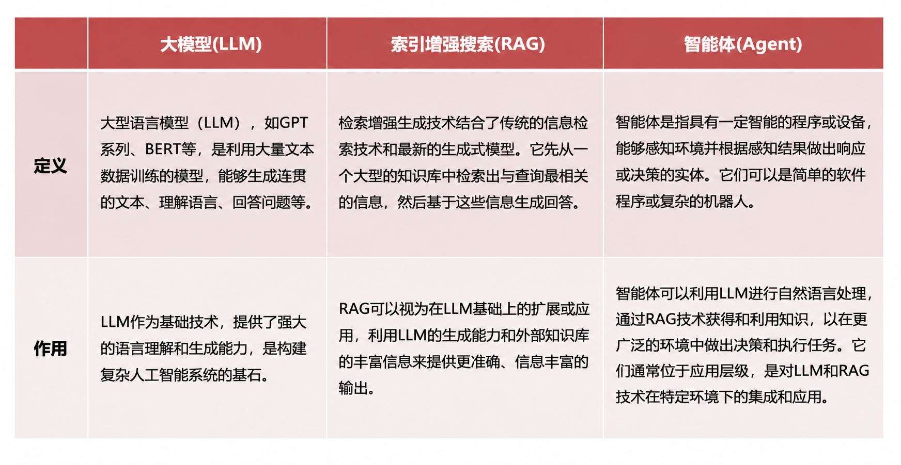
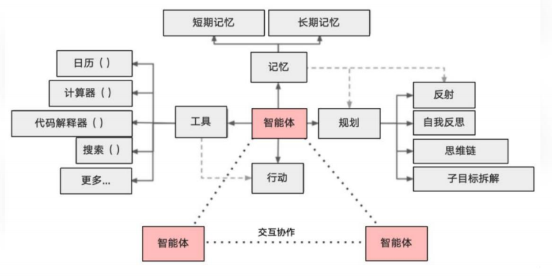
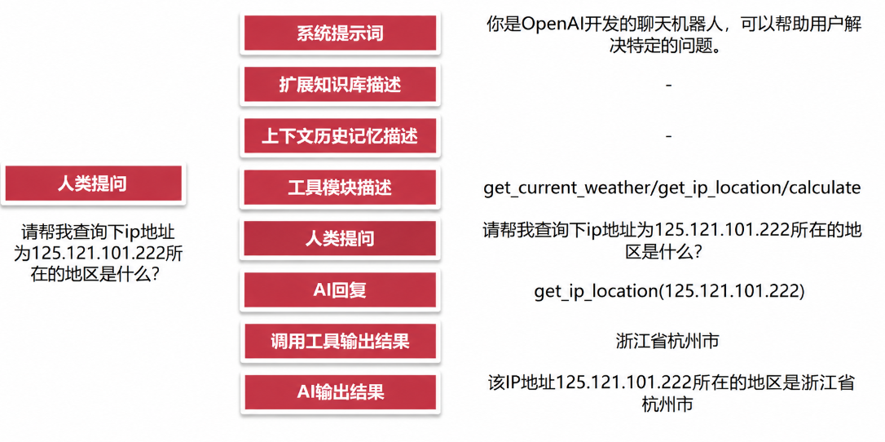
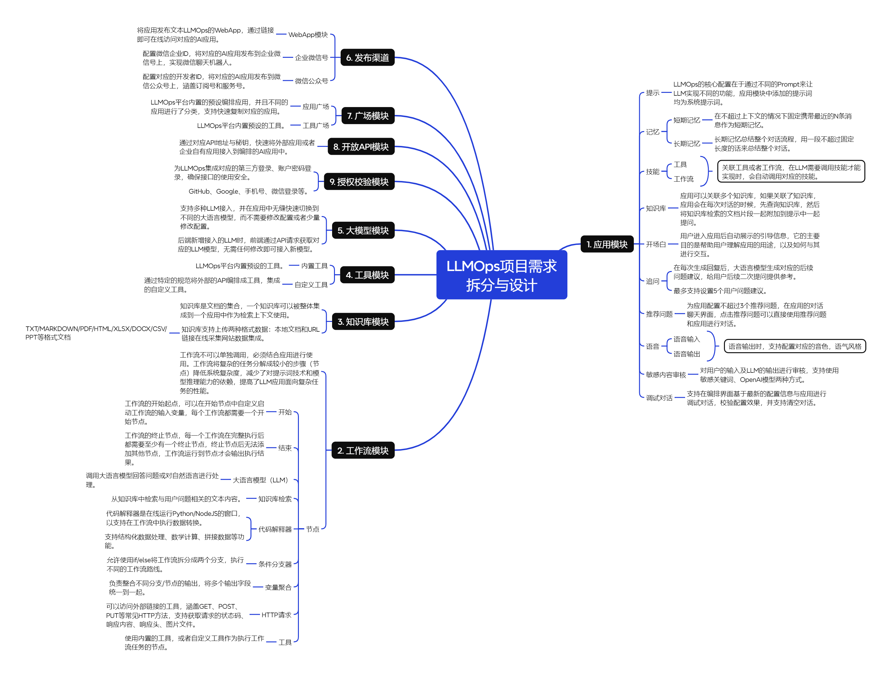
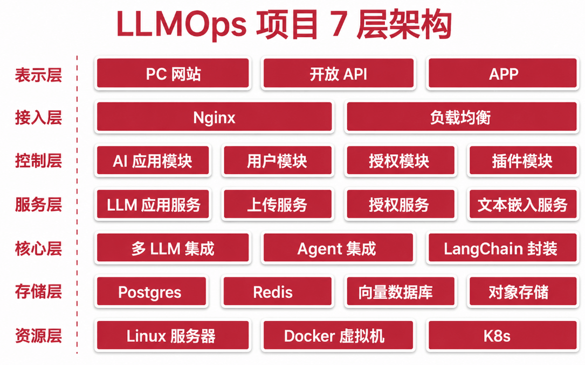
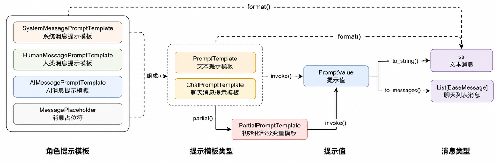

### ai学习

#### 大语言模型的基础单位Token

Token其实就是文本的片段，是大模型计算长度的单位，对于汉字，可以是字、词、甚至是半个字或者三分之一个字。

#### 预测token的机制

基于统计，通过大量数据的统计，找到下一个token

#### Agent

智能体指代具有自主性和智能的程序或系统，能够通过感知、规划、决策并执行相关任务



####  AI专有名词

- **LLM-大型语言模型**

  LLM是基于深度学习技术构建的人工智能模型，由具有数以亿计参数的人工神经网络组成，通过自监督学习或半监督学习在大量无标签文本上上进行训练。

- **AIGC-AI生成内容**

  AIGC（AI-Generated Content）通过对已有数据进行学习和模式识别，以适当的泛化能力生成相关内容的技术

- **AGI-人工通用智能**

  AGI (Artificial General Intelligence)全称人工通用智能，是指能够理解、学习和应用广泛的知识和技能的人工智能系统。

- **Agent-智能代理**

  Agent（智能代理）一个能够自主感知环境并采取行动的计算实体，其目标是最大化某种预定义的效用或实现特定的目标。

  AGI可以看成是一种非常高级的Agent，具备广泛适应性和

  自我学习能力，Agent也是现阶段AGI的最佳实现方式。

- **Prompt-提示词**

  Prompt是指给定的一段文本或问题，用于引导和启发人工智能模型生成相关的回答或内容。
  Prompt是目前人类与LLM大语言模型交互的核心方式。、

- **GPT-生成型预训练变换模型**

  GPT (Generative Pre-trained Transformer)是种基于深度学习的大型语言模型

  GPT模型最初由OpenAI开发，旨在通过训练模型预测下一个单词或字符来学习自然语言的统计规律。

- **Token-文本基础单元**

  Token是指在自然语言处理和文本处理任务中，将文本分解成较小单元的基本单位。这些单元可以是单词、字符、子词或其他语言单位，具体取决于任务和处理方式。

  大语言模型中的上下文长度计算一般都是基于Token，而不是字符，例如GPT-4的16K上下文意味着传递的消息不能超过16K个Token。

- **LoRA-插件式微调**

  LoRA (Low-Rank Adaptation of LLM)即插件式微调，用于对大语言模型进行个性化的特定任务的定制。

  LORA通过将模型的权重矩阵分解成低秩的相似矩阵，降低了参数空间的复杂性，从而减少微调的计算成本和模型存储要求。

- **矢量/向量数据库**

  矢量数据库是一种用于存储矢量/向量数据的数据库。
  矢量数据库可以存储和管理大量的矢量数据，例如图像、视频、音频、文本等，同时提供高效检索功能。

- **数据蒸馏**

  数据蒸馏指将给定的原始大数据集浓缩并生成一个小型数据，使得在小数据集上训练出来的模型与原数据集上训练的模型相似。
  数据蒸馏在深度学习领域被广泛应用，可以帮助将复杂的模型转换成更轻量级的模型，提高模型的鲁棒性和泛化能力。

#### LLM/RAG/Agent的技术路线

LLM/RAG/Agent已经成为人工智能领域进步的关键技术，理解这三者的概念与关系是做好面向AI编程开发的基础。



#### AI Agent的定义与技术架构



#### 手动模拟Agent流程图



#### LLMOps项目需求拆分与设计



#### 智能体、skills、工具、MCP

用户
 ↓
智能体：理解用户要什么
 ↓
Skills：判断这类任务应该怎么做
 ↓
工具：执行具体动作
 ↓
MCP：连接外部系统里的工具/数据

##### 智能体负责理解你要干嘛、判断要查什么、调用什么能力、最后组织回答。

##### Skills：更像“封装好的专项能力 / 使用说明书”  一个SOP

##### 工具：负责“干一个具体动作”  比如查订单工具 输入客户名，返回订单

##### MCP 是一种把外部工具接进来的协议

用户提问
 ↓
MaxKB 智能体理解：这是查销售数据
 ↓
发现 MCP 里有 query_database 工具
 ↓
调用 MCP Server：
{
  "tool": "query_database",
  "arguments": {
    "sql": "SELECT ..."
  }
}
 ↓
MCP Server 去数据库查询
 ↓
返回结果
 ↓
智能体组织成自然语言回答

```python
from mcp.server.fastmcp import FastMCP

mcp = FastMCP("order-mcp")

@mcp.tool()
def get_order(order_id: str) -> dict:
    """
    根据订单号查询订单信息
    """
    这里先写死，真实场景可以查数据库、调接口
    return {
        "order_id": order_id,
        "status": "已发货",
        "amount": 299,
        "customer": "张三"
    }

if __name__ == "__main__":
    mcp.run(transport="sse")
```

#### LLMOps项目7层架构



#### 项目目录结构约定、规范与依赖注入

##### 项目结构

```js
---app // 应用入口集合
| ├---__init__.py
| └---http
|---config // 应用配置文件
| ├---__init__.py
| ├---config.py
| └---default_config.py
|---internal // 应用所有内部文件夹
| ├---core // LLM核心文件，集成LangChain、LLM、Embedding等非逻辑的代码
| | |---agent
| | |---chain
| | |---prompt
| | |---model_runtime
| | |---moderation
| | |---tool
| | |---vector_store
| | └---...
| ├---exception // 通用公共异常目录
| | ├---__init__.py
| | ├---exception.py
| | └---...
| ├---extension // Flask扩展文件目录
| | ├---__init__.py
| | ├---database_extension.py
| | └---...
| ├---handler // 路由处理器、控制器目录
| | ├---__init__.py
| | ├---account_handler.py
| | └---...
| ├---middleware // 应用中间件目录，包含校验是否登录
| | ├---__init__.py
| | └---middleware.py
| | └---...
| ├---migration // 数据库迁移文件目录，自动生成
| | ├---versions
| | └---...
| ├---model // 数据库模型文件目录
| | ├---__init__.py
| | ├---account.py
| | └---...
| ├---router // 应用路由文件夹
| | ├---__init__.py
| | ├---router.py
| | └---...
| ├---schedule // 调度任务、定时任务文件夹
| | ├---__init__.py
| | └---...
| ├---schema // 请求和响应的结构体
| | ├---__init__.py
| | └---...
| ├---server // 构建的应用，与app文件夹对应
| | ├---__init__.py
| | └---...
| ├---service // 服务层文件夹
| | ├---__init__.py
| | ├---oauth_service.py
| | └---...
| ├---task // 任务文件夹，支持即时任务+延迟任务
| | ├---__init__.py
| | └---...
|---pkg // 扩展包文件夹
| ├---__init__.py
| |---oauth
| | ├---__init__.py
| | ├---github_oauth.py
| | └---...
| └---... ├---storage // 本地存储文件夹
├---test // 测试目录
├---venv // 虚拟环境
├---.env // 应用配置文件
├---.gitignore // 配置git忽略文件
├---requirements.txt // 第三方包依赖管理
└---README.md // 项目说明文件
```

#### 文件与Python类函数命名规范

##### 文件名

使用全部小写字母。

使用下划线分隔单词，例如： app_service.py 。

尽可能保证文件作用的单一，不要把所有代码一次性写在同一个文件中。

##### 类名

使用驼峰命名法，例如：class AppService。

类名应该以大写字母开头，每个单词的首字母都大写。

如果类名由多个单词组成，单词之间不使用下划线分割。

##### 函数名和方法

使用小写字母。

使用下划线分隔单词。

例如： get_account ， generate_token 等。3.4 变量名

使用小写字母。

使用下划线分隔单词。

例如： my_variable ， token_count 。

##### 常量

使用全大写字母。

使用下划线分隔单词。

例如： MAX_SIZE ， PI 等。

##### 私有变量与方法

以一个下划线开头表示私有，例如： _my_private_variable ， _my_private_method() 等。

在 Python 中并没有严格的私有变量/方法，这种命名约定只是一种约定，而不是强制规则，实际上

这些变量/方法仍然可以被使用，但是作为一种约定，在外部调用时，不应该调用私有的变量与方

法。

##### 模块名

与文件名类似，使用全部小写字母，使用下划线分隔单词。

例如： my_module.py 对应的模块名应该是 my_module 。

模块下创建 __init__.py 文件代表当前目录为一个模块，并尽可能在 __init__.py 中使用

__all__ 简化导出。

#### Flask-SQLALchemy  ORM

ORM其实是对象映射关系（object-Relational Mapping），即将数据库中的表与面向对象编程中的类关联起来，它把数据库中的表映射
为类，表中的行映射为类的实例，表中的列映射为类的属性。这样一来，就可以通过对类的操作来进行数据库的增删改查，而不必直接操
作数据库，让程序员更加专注于业务逻辑，减少了与数据库交互的复杂性。

- 优点
  - 有语法提示，省去自已拼写SQL，保证SQL语法的正确性；
  - ORM提供方言功能（dialect，可以转换为多种数据库语法），减少学习成本与迁移数据库的成本；
  - 面向对象，可读性强，开发效率高；
  - 防止sql注入攻击；
  - 搭配数据库迁移，更新数据库方便；
- 缺点
  - 需要语法转换，效率比原生sql低；
  - 复杂的查询往往语法比较复杂（可以使用原生sq代替）；

### ORM模型的增删改查 Flask-SQLALchemy

### python常见指令

- python -m venv .venv 虚拟环境
- pip freeze > requirements.txt 把当前 Python 环境里**所有已安装的第三方包 + 对应版本**，导出到 `requirements.txt` 文件，用来记录项目依赖，方便别人一键复现相同环境。

### python常见包

- python-dotenv    `.env` 配置文件中读取键值对，加载到当前 Python 进程的环境变量中

- Flask-wtf   数据校验CSRF保护等 

- cookiecutter   脚手架 比较类似于前端的vue-cli

  **高频常用模板**：

  - Web 开发：`cookiecutter-django`、`cookiecutter-flask`、`cookiecutter-fastapi`
  - 包开发：`cookiecutter-pypackage`（标准 Python 开源包模板）

- Copier    Cookiecutter 的进阶版，解决了旧模板生成后无法同步更新的痛点

- flask-sqlalchemy    Flask 框架中用来操作数据库的扩展 

- psycopg2    Python 用来连接和操作 PostgreSQL 数据库的驱动库

- flask-migrate  用来管理 **Flask 项目数据库结构变更** 的扩展

  - flask --app app.http.app db init 初始化迁移
  - flask --app app.http.app db upgrade  迁移
  - flask --app app.http.app db downgrade 回退
  - flask --app app.http.app db downgrade base 回退到最初的版本


### Claude Code

安装 winget install -e --id Anthropic.ClaudeCode

### LangChain

大模型一般有两种形态“呈现”在我们眼前，一种是训练好的那种二进制文件，另外一种是将大模型的二进制文件进行部署之后暴露出一些相应的接口。但是无论是哪种形式，LLM 只提供了一个非常基础的调用方式，当我们要构建一个复杂的 Chat Bot 时，就需要考虑如何保存聊天的上下文、如何进行网络检索、如何加载本地数据、如何便捷管理 Prompt 等等工程问题。

甚至是当我们切换到不同的 LLM 时，模型的输入和输出结构差异都非常巨大，微量的需求就需要修改大量的代码，或者在业务代码中做大量的判断与识别，让代码可维护性极差；但是其实不同 LLM 的交互流程其实都非常接近，如下可以看成是一个基础聊天机器人的链条，传入提示词、输出对应的结果，流程如下：

​				构造提示词 → LLMs → 模型生成结果 → 处理结果 → 最终结果

除了在代码开发这方面有大量的疑难杂项之外，对 LLM 的运行流程、输出、费用统计、错误监控也是一个非常重要的部分，这些功能基础的 LLM 均没有提供，需要程序员自行开发与对接，开发这些功能的耗时甚至会超过业务的部分，极大提升了 AI 应用开发的难度。

为了解决以上这些问题，AI 应用开发框架应运而生，其中最热门、更新速度最快、最稳定的框架就是 LangChain，而且目前 LangChain 提供了 Python 和 JavaScript 两个版本，适配了当前 AI 环境下最热门的两种语言。

#### 开源库

- **langchain-core**：基础抽象和 LangChain 表达式语言。
- **langchain-community**：第三方集成以及合作伙伴包（如 langchain-openai、langchain-anthropic 等），一些集成已经进一步拆分为自己的轻量级包，只依赖于 langchain-core。
- **langchain**：构建应用程序认知架构的链、代理和检索策略，给你现成的 AI 应用/Agent 组件，方便快速搭起来。
- **langgraph**：通过将步骤构建为图中的边和节点，使用 LLMs 构建健壮且有状态的多参与者应用程序，让你自己精确控制 Agent 的执行流程、状态和分支。
- **langserve**：将 LangChain 链部署为 REST API。
- **langsmith**：一个开发平台，可以让你调试、测试、评估和监控 LLM 应用程序，并与 LangChain 无缝衔接。

#### prompt组件



